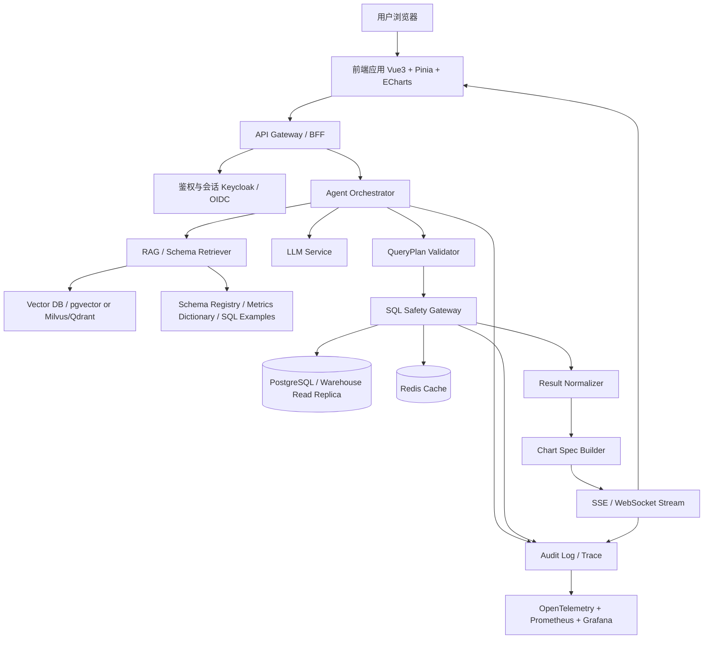
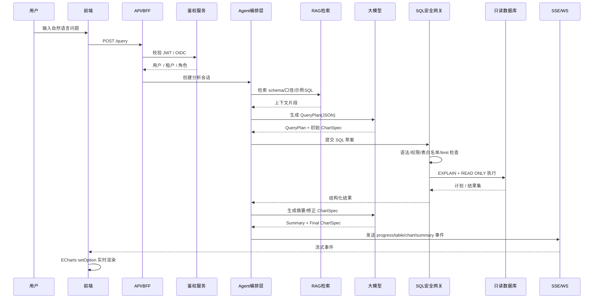

# 智能数据分析系统底层架构设计研究报告

## 执行摘要

基于“接入大模型、自然语言查询数据库、前端实时渲染可视化图表”这三个核心需求，我的结论是：**最稳妥的企业级方案不是“让大模型直接查库并吐图”，而是搭建一个分层、受控、可审计的 AI 数据执行平面**。其中，大模型只负责“理解意图、规划步骤、生成受约束的查询计划与图表规格”；数据库访问必须经过独立的 **SQL 安全网关**；前端实时展示则通过 **SSE 为主、WebSocket 为辅** 的流式事件通道接收“进度、表格、图表 spec、总结”四类事件，再用 Apache ECharts 做渐进式渲染。FastAPI 原生支持 WebSocket/SSE，ECharts 官方也明确支持通过 `setOption` 做异步更新、loading 动画与数据过渡。

如果团队没有强.NET 生态约束，建议以 **Python 为主线**：后端用 FastAPI + Pydantic + SQLAlchemy，Agent 层优先采用 LangChain/LangGraph 或 LlamaIndex；数据库优先选择 PostgreSQL，并在 MVP 阶段直接配合 pgvector，随着规模提升再考虑 Milvus 或 Qdrant；缓存使用 Redis；权限和审计采用 Keycloak + PostgreSQL RLS；监控采用 OpenTelemetry + Prometheus + Grafana；轻量异步任务可先用 FastAPI BackgroundTasks，任务变长、补偿和重试复杂后升级到 Celery 或 Temporal。若企业已经深度采用 Microsoft 技术栈、M365 或.NET，则 Semantic Kernel 会更贴近企业治理与插件化控制。前端优先采用由 Apache Software Foundation 管理的 Apache ECharts，辅以 SSE 和 Pinia/Vue 的状态管理。

在框架选型上，**LangChain/LangGraph 胜在生态完整与 SQL agent 实战材料丰富**，**LlamaIndex 胜在“数据接入 + Query Engine + Text-to-SQL + 结构化/非结构化联合查询”**，**Haystack 胜在企业可观测性和显式 Pipeline 透明度**，**Semantic Kernel 胜在企业治理、插件与 OTel 兼容性**，**OpenAI Agents SDK/Responses API 胜在结构化输出、Tracing、handoff、guardrails/human review 的官方一体化能力**。这些框架都能用，但适配方向不同：如果你要“快速做出企业可用产品”，我更推荐 **FastAPI + LangGraph/LangChain + PostgreSQL + pgvector + Redis + ECharts** 作为默认基线；如果你更看重企业治理与长期平台化，则可转向 **Semantic Kernel** 作为 orchestration 层。

在开源项目层面，**DB-GPT** 很适合作为中文语境下的参考蓝本，因为它覆盖了数据库连接、AI 自主写 SQL、Python 分析、图表和报告等完整链路；**Chat2DB** 更适合作为“智能数据库客户端/运维工具”的参考；**Apache Superset** 非常适合做成熟的可嵌入看板层，但并不适合作为 Agent 查询执行核心；**Vanna** 仍然有参考价值，但其 GitHub 仓库已在 2026-03-29 被归档，而且 2026 年初暴露出多项安全问题，因此**不建议把它作为新项目的一线生产骨架**。

预算、并发量、数据敏感性、是否使用私有模型目前均未指定；这四项会直接决定是否使用托管模型、是否需要自建 vLLM/TensorRT-LLM、是否需要多集群隔离、以及向量库是否要独立拆分。公开定价表明，API 模式通常按 token 计费，云 GPU 资源按小时计费；因此**低预算优先用托管 API 与 Postgres/pgvector 单栈， 中预算引入独立向量库与 K8s， 高预算或高敏感场景再进入私有模型与 GPU 推理集群**。

## 需求拆解与设计原则

你的系统，本质上不是一个“聊天机器人”，而是一个 **受控的数据分析执行系统**。它至少包含四条互相解耦但协作紧密的链路：第一条是**语义理解链路**，把自然语言转成查询意图、过滤条件、分组、排序、时间窗口和目标图表；第二条是**安全执行链路**，把查询意图变成带权限约束的 SQL 计划并在只读上下文执行；第三条是**结果解释链路**，把表格型结果转成图表规格和自然语言总结；第四条是**实时交付链路**，把多阶段事件按流式方式推给前端，从而实现“边查边看、边算边出图”。LangChain、LlamaIndex、Semantic Kernel 和 OpenAI Agents SDK 的官方文档都把“工具调用、插件、结构化输出、多阶段编排、追踪”视为构建复杂 agent 应用的基础机制。

这个系统要成立，必须坚持三个原则。第一，**大模型不直接握有高权限数据库连接**。LangChain 与 LlamaIndex 的 SQL 文档都明确提醒：执行模型生成 SQL 本身就带有固有风险，连接权限必须尽可能收缩。第二，**所有执行都必须结构化与可审计**，包括：输入 prompt、检索到的 schema/example、生成的 SQL、校验结果、执行耗时、返回行数、图表 spec、用户身份、租户号。OpenAI Agents SDK、LangSmith、Haystack tracing 与 Semantic Kernel observability 都提供了类似思路：把模型调用、工具调用、handoff、guardrails、运行轨迹纳入 tracing。第三，**图表生成不能完全依赖模型自由发挥**，而应由模型输出受约束的图表语义，再由前端渲染层映射到 ECharts/Plotly/D3 配置。

从工程切面看，推荐把系统划分为“控制面”和“数据面”。控制面负责鉴权、会话、路由、模板、策略、追踪、成本控制；数据面负责 schema 拉取、RAG 检索、SQL 生成、校验、执行、结果规范化、图表渲染事件输出。这样做好处是，后续你既可以更换模型提供方，也可以把数据库从 PostgreSQL 切到内部数仓，而不会推翻整个产品。Semantic Kernel 强调其 middleware/connector 思路，LangChain 强调 provider 可替换与大量 integrations，LlamaIndex 强调 query engine 与 data adapters，Qdrant、Milvus 也都强调及早设计多租户与分片/分区策略。

## 大模型核心技术评估

下表采用“低 / 中 / 高”的**相对成本与复杂度**评级。这里的“云成本”主要受 API token 单价、托管向量库和云 GPU 按量价格影响；“本地成本”主要受 GPU 型号、显存、运维人力和高可用要求影响。公开资料显示，托管模型大多按 token 计费，而云 GPU 实例和加速型实例按小时计费；因此本报告在此不给绝对价格，而给出相对级别，更适合前期架构决策。

| 技术 | 在本系统中的用途 | 优点 | 缺点 / 风险 | 适用场景 | 实现复杂度 | 云成本 | 本地成本 | 依据 |
|---|---|---|---|---|---|---|---|---|
| RAG | 让模型在生成 SQL 或解释结果前先检索 schema、业务口径、历史 SQL、指标定义 | 降低幻觉；便于引入企业知识；支持 schema 变更后的快速适配 | 检索质量差会把错误上下文带入；需要处理知识更新与切分策略 | 指标口径复杂、表多、字段命名不直观、需要业务术语映射 | 中 | 低-中 | 中 | Semantic Kernel 将 vector store 作为 RAG 基础能力；LlamaIndex Query Engine 与 SQLAutoVector 直接支持结构化/非结构化联合检索。 |
| 语义解析 / Text-to-SQL | 把自然语言转为 SQL 查询计划与 SQL 语句 | 是整个系统的核心；适合报表查询、聚合统计、指标追问 | 受 schema 质量和示例 SQL 质量影响显著；存在注入和越权风险 | 结构化表查询、OLAP 指标、运营数据问答 | 中-高 | 低-中 | 中 | LlamaIndex 的 Text-to-SQL 与 LangChain SQL Agent 都提供现成范式，并明确提示要限制权限。 |
| 工具调用 / 函数调用 | 把“列出表、取 schema、查询 SQL、检查 SQL、生成图表 spec、导出报告”等动作显式化 | 透明、可审计、可插拔，适合企业控制 | 工具数量增加后编排复杂；错误恢复与重试策略要设计 | 需要多步推理、可观察、可扩展的生产系统 | 中 | 低 | 低 | OpenAI Agents SDK、Semantic Kernel Plugins、LangChain SQL toolkit 都围绕 tools/plugins 构建。 |
| 结构化输出 | 让模型输出固定 JSON Schema，例如 QueryPlan、ChartSpec、FollowUpSuggestion | 极大提升可用性与前后端契约稳定性；方便校验与回放 | Schema 设计要足够严谨；过于僵硬会降低生成灵活性 | 任何需要进入程序执行或前端渲染的模型输出 | 低-中 | 低 | 低 | OpenAI Structured Outputs 明确支持基于 JSON Schema 的严格输出。 |
| 链式规划 / Agent 编排 | 把复杂问题拆成“识别意图 → 检索上下文 → 选表 → 生成 SQL → 校验 → 执行 → 出图 → 总结” | 更适合复杂分析、多步澄清、跨工具 | 过度 agent 化会放大延迟、成本和调试难度 | 复杂多跳分析、带解释和图表推荐的问答 | 中-高 | 中 | 中 | OpenAI handoffs / guardrails、LlamaIndex workflows、Haystack pipelines 都说明了显式编排的价值。 |
| 微调 / 指令调优 / LoRA | 让模型更懂你的 SQL 风格、口径与业务习惯 | 特定域效果可提升；LoRA/PEFT 成本低于全量微调 | 数据集构建成本高；迁移和评估复杂；效果常不如“高质量 RAG + 示例 SQL”来得稳 | 领域术语强、SQL 风格稳定、数据口径非常固定的企业场景 | 高 | 中-高 | 中-高 | LoRA 论文指出其可显著减少可训练参数和显存需求；PEFT 示例显示可在消费级硬件上进行部分大模型调优。 |
| 向量数据库 | 存储 schema 文档、历史 SQL、指标定义、FAQ、数据字典的向量与元数据 | 让 RAG 真正可用；支持语义检索与 metadata filtering | 需要设计分片、多租户、重建索引与 embedding 升级 | 中大型知识库；多租户；需要 hybrid search | 中 | 低-中 | 中 | Milvus 与 Qdrant 都强调 metadata / filtering / multitenancy；Qdrant 还明确建议多数场景以单 collection + payload 分区实现多租户。 |
| Embedding | 把 schema、指标定义、历史示例 SQL 与业务文档转成向量 | 是 RAG 和示例检索基础；对 SQL 生成准确率影响很大 | 模型升级会带来重建成本；跨语言与术语漂移需校验 | 中英文混合 schema、复杂业务术语、跨库示例检索 | 低-中 | 低 | 中 | 向量库文档强调 dense / sparse vector 与 metadata filter 的联合使用价值。 |
| 模型并行 / 推理优化 | 在自建模型时提升吞吐与降低显存占用，如 tensor parallel、pipeline parallel、quantization、KV cache 优化 | 是私有部署与高并发场景的关键；降低单位请求成本 | GPU 与运维复杂度高；环境稳定性与驱动依赖重 | 高并发、私有模型、成本敏感、长上下文 | 高 | 中-高 | 高 | vLLM 支持 tensor/pipeline parallel；vLLM/TensorRT-LLM 都强调 quantization、KV cache、并行与调度优化。 |

结合你的需求，**优先级最高的组合**并不是“先微调”，而是：**结构化输出 + 工具调用 + Text-to-SQL + 轻量 RAG + 只读安全网关 + 流式可视化**。微调/LoRA 放在第二阶段是否启用，取决于：一是你是否已经积累了足够高质量的问句-SQL-结果闭环数据；二是当前错误率到底来自“模型能力不足”还是“schema 暴露不清、示例 SQL 不足、权限与口径未结构化”。在多数企业项目里，后者更常见。

## Agent 框架与开源项目评估

### 主流 agent / 工具调用框架对比

| 框架 | 定位与强项 | 数据库 / 可视化集成 | 企业级特性 | 语言支持 | 许可证 / 商业模式 | 适配建议 |
|---|---|---|---|---|---|---|
| LangChain / LangGraph | 生态最全，SQL agent、provider、middleware、toolkit 丰富；适合快速搭建通用 agent 系统。 | 官方有 SQL agent / custom SQL agent 教程，且支持 Python、JS 文档生态；图表层通常需要自行对接 ECharts/Plotly。 | 配合 LangSmith 可做 tracing、评估与监控；但 IAM、审计、审批不属于框架内建，需要系统自补。 | Python、TypeScript/JavaScript。 | MIT。 | **默认推荐**。适合你这种“数据库 + tool calling + 流式前端”的应用，尤其适合 Python 主栈。 |
| LlamaIndex | 强在“数据接入—索引—query engine—agent”一体化，Text-to-SQL、SQLAutoVector、Workflows 很贴题。 | 对结构化与非结构化数据的联合查询能力最突出；适合 schema 文档、指标口径和 SQL 示例一起接入。 | Workflows 是 event-driven、async-first；但企业治理能力主要仍依赖外围系统。 | Python、TypeScript/JavaScript。 | MIT。 | **非常适合本项目**。如果你希望把 schema/RAG/查询引擎做得更“数据框架化”，它比 LangChain 更聚焦。 |
| Haystack | 显式 Pipeline 和组件化较强，适合强调透明流程和生产可观测性。 | 有 SQLAlchemy retriever 与“chat with SQL” cookbook，但 NL2SQL 不是其最强原生主线，往往要自定义组件。 | 对 OpenTelemetry tracing 友好，企业可观测性较好。 | Python。 | Apache 2.0。 | 若你更偏“可解释 Pipeline”和企业 observability，而非快速迭代 agent 玩法，可选。 |
| Semantic Kernel | 强在 enterprise-ready 中间层、Plugins、Filters、OTel observability、AI service integrations。 | 通过 Plugins / Function Calling 接数据库或企业 API 很自然，但现成 SQL agent 资料不如 LangChain/LlamaIndex 丰富。 | 文档明确强调 enterprise-grade、非破坏性稳定版本、OTel 兼容、filters 用于安全与治理。 | C#、Python、Java。 | MIT。 | **.NET / Microsoft 生态优先选项**。若组织已有 Azure、M365 或 C# 团队，这是很强候选。 |
| OpenAI Agents SDK / Responses API | 官方一体化能力强：structured outputs、tools、handoff、guardrails/human review、built-in tracing。 | 数据库与可视化主要靠你自己封装 tools；优点是“模型交互契约”更稳定。 | tracing、guardrails、human review 都是亮点；但这是“官方 SDK + API”路线，不是通用开源生态替代物。 | Python、JavaScript/TypeScript。 | SDK 为 MIT，底层模型服务为商业 API。 | 若你希望把“结构化输出、护栏、人工审批、追踪”做得最稳，且可接受托管模型依赖，非常合适。 |

综合比较后，我建议把框架决策放在**组织技术栈**与**治理诉求**两个维度上。若你以 Python 为主、希望最快落地，**LangGraph/LangChain 是默认答案**；若你想把 schema、RAG、SQL 和 unstructured docs 的查询体验统一在一个数据框架里，**LlamaIndex 更顺手**；若你所在组织重视 OTel、审批、Filters、Microsoft 生态与 Java/C# 共存，**Semantic Kernel 的长期平台化价值更高**；若你希望直接依赖官方模型交互契约来提升输出稳定性，**OpenAI Agents SDK/Responses API 值得作为“模型控制内核”接入**。

### 相关开源项目 / 示例分析

| 项目 | 简介 | 关键模块 | 适配点 | 优点 | 缺点 | 活跃度与现状 | 适合作为 |
|---|---|---|---|---|---|---|---|
| DB-GPT | 中文社区中少见的完整“AI + Data”平台，可连接数据库、CSV/Excel、知识库，自动写 SQL、执行 Python 分析、输出图表/Dashboard/HTML 报告。 | agents、AWEL、RAG、多模型、skills、图表与报告。 | 与你的目标最接近，尤其适合作为“平台能力拆解”参考。 | 中文资料友好，覆盖从查询到报告的全链路。 | 平台较重；直接二次开发需要理解其框架边界。 | 公开 release 到 v0.8.0，Issues 在 2026-04-24 仍活跃。 | **首选参考蓝本** |
| Chat2DB | AI 驱动的通用数据库客户端，可做自然语言转 SQL、SQL 转自然语言、数据报表。 | 多数据库连接、SQL 生成、报表、客户端 UI。 | 适合作为“数据库管理 + AI 辅助查询”交互参考。 | 上手快，数据库工具属性明确，中文社区友好。 | 更像“智能数据库客户端”，不是完整 agent 平台；对你要的平台化后端借鉴有限。 | 公开 release 最新为 2025-01-14 的 0.3.7。 | 运维/DBA 参考与客户端能力参考 |
| Apache Superset | 成熟的数据探索与可视化平台，支持嵌入式看板。 | SQL Lab、图表、Dashboard、Embedded SDK。 | 若你需要把 AI 查询结果沉淀为标准化看板，可让其承担 BI 层。 | 可视化成熟、嵌入能力明确、社区稳定。 | 不是 NL2SQL / agent 执行内核；二次改造成“智能分析前端”并不轻。 | 2026-02 仍有 6.1.0rc1 发布流程，社区更新活跃。 | BI / Dashboard 层 |
| LlamaIndex SQLAutoVector / Text-to-SQL 示例 | 官方示例展示了 Text-to-SQL 与向量检索联合决策。 | NLSQLTableQueryEngine、SQLAutoVectorQueryEngine、workflow。 | 特别适合“数据库 + 文档知识”混合问答。 | 设计路径贴近你要的第二阶段能力。 | 更偏参考实现，需要自己补全权限、审计、前端与多租户。 | 官方文档与工作流仓库保持更新。 | 核心算法与中台参考 |
| LangChain / LangGraph SQL agent 示例 | 官方提供 SQL agent 与 custom SQL agent 方案。 | SQL toolkit、query checker、LangGraph 自定义节点。 | 特别适合“受控工具流 + 自定义安全节点”设计。 | 易与 FastAPI、Redis、前端流式交付集成。 | 组件多，架构约束要靠自己定。 | 生态和文档都非常活跃。 | **默认实现参考** |
| Vanna | 主打自然语言转 SQL 和 Rich UI 输出。其 2.0 介绍强调用户感知权限、实时 tables/charts 流式输出。 | Tool memory、Web UI、SQL agent。 | 概念对你有启发，尤其是“流式表格+图表组件”。 | 产品表达清晰，前端组件思路值得参考。 | 其 GitHub 仓库已于 2026-03-29 归档；同时 2026 年初出现 RCE / SQL 注入等安全问题讨论。 | **不建议新项目作为主骨架** |

这里最值得强调的是：**DB-GPT 是“产品形态参考”，LangChain/LlamaIndex 是“实现骨架参考”，Superset 是“成熟 BI 层参考”**。它们不是互斥关系。一个很实用的组合是：**用 LangGraph/LlamaIndex 做查询执行和智能编排，用 ECharts 做实时会话内图表，用 Superset 只承接沉淀后的标准看板**。这样既保留实时 Agent 交互能力，又不放弃成熟 BI 体系。

## 推荐架构与技术选型

### 推荐的总体分层

我推荐采用如下分层：

1. **接入层**：Web 前端、BFF/API Gateway、统一鉴权。
2. **Agent 编排层**：意图识别、RAG、QueryPlan 生成、ChartSpec 生成、总结生成。
3. **安全执行层**：SQL parser/linter、权限注入、只读事务、statement timeout、EXPLAIN 预检查。
4. **数据访问层**：PostgreSQL / 数仓连接、连接池、Schema Registry、结果规范化。
5. **知识检索层**：向量库、embedding、业务口径 / 数据字典 / 示例 SQL。
6. **实时交付层**：SSE / WebSocket 事件流、结果缓存、前端图表渲染。
7. **治理与可观测层**：审计日志、trace、指标、告警、成本计量。

下面的 Mermaid 图是我建议的基线体系图：



这张图背后的关键设计依据是：FastAPI 天然适合 API + WebSocket/SSE；SQLAlchemy 的 Engine/连接池适合并发访问；PostgreSQL 原生支持 RLS、只读事务与 EXPLAIN；Keycloak 提供 OIDC 和细粒度授权；Prometheus / OTel / Grafana 形成主流可观测组合。

### 关键交互时序



这里最重要的不是“SQL 能不能跑出来”，而是**权限与策略是在 SQL 执行前完成，而不是事后补救**。PostgreSQL 文档明确给出了 RLS、READ ONLY transaction、EXPLAIN 的原生能力；FastAPI 文档则表明你可以在同一后端里同时维护普通 HTTP、SSE 与 WebSocket 交互通道。

### 后端技术栈建议

| 层 | 推荐选型 | 推荐理由 | 替代方案 |
|---|---|---|---|
| 模型接入 | 托管 API 起步；中高阶切 vLLM；纯 NVIDIA 高性能场景再考虑 TensorRT-LLM | 托管 API 上线快；vLLM 支持分布式并行与多种量化；TensorRT-LLM 在 NVIDIA 栈上优化深入。 | 继续只用托管 API；或内部统一模型网关 |
| API / BFF | FastAPI | 高性能、依赖注入清晰、适合 API + SSE + WebSocket；对 Python AI 生态最友好。 | NestJS、Spring Boot |
| Agent / 工具编排 | LangGraph/LangChain 为默认；Semantic Kernel 为企业替代；LlamaIndex 负责数据感知型查询引擎 | LangGraph 适合显式步骤控制；LlamaIndex 强在 Query Engine；SK 强在 enterprise readiness。 | Haystack |
| DB 连接层 | SQLAlchemy + 连接池 + 只读用户 | SQLAlchemy Engine 天然适合并发与连接池复用；便于 ORM/SQL Core 混用。 | 数据源 SDK 直连 |
| 查询安全层 | 自研 SQL Safety Gateway | 需要做 SQL 解析、白名单、租户注入、limit、timeout、EXPLAIN、审计；这是业务核心，建议掌握在自己手里。 | 无 |
| 主数据库 | PostgreSQL + 只读副本 / 现有数仓 | RLS、读写权限、EXPLAIN、事务控制成熟；MVP 成本低。 | 现有企业数仓 |
| 向量库 | MVP：pgvector；规模化：Milvus 或 Qdrant | Postgres 一体化最省事；Milvus/Qdrant 在多租户、规模和过滤上更强。 | 独立 Elastic / 检索层 |
| 缓存 / 事件 | Redis | 缓存可用 cache-aside；Pub/Sub 适合实时广播，但语义是 at-most-once，关键事件不应用它做唯一消息源。 | Kafka / NATS |
| 权限与审计 | Keycloak + PostgreSQL RLS + 审计表 | OIDC / OAuth2 / 细粒度授权 + 数据行级权限非常适合多租户分析平台。 | 自研 IAM / 云 IAM |
| 异步任务 | 低配：BackgroundTasks；中配：Celery；高配：Temporal | 前者适合轻量后处理；Celery 适合常规队列任务；Temporal 适合长流程、补偿、重试、人工干预。 | Arq / Dramatiq |
| 监控与日志 | OpenTelemetry + Prometheus + Grafana | OTel 负责 traces / metrics / logs 统一语义；Prometheus 擅长微服务数值指标；Grafana 做统一展示。 | Langfuse / 云厂商原生观测 |

后端最关键的一层，是 **SQL Safety Gateway**。这一层不应只是“检查一下是不是 SELECT”，而应至少包含：SQL 方言解析、危险关键词拦截、表/列白名单、租户过滤自动注入、行数上限、statement timeout、只读事务、慢查询分流、EXPLAIN 成本检查、审计与追踪打点。PostgreSQL 官方文档已经足够支撑这套设计：RLS 控行级权限，只读事务阻断写操作，EXPLAIN 可用于执行前的计划评估。

### 前端技术栈建议

我推荐前端优先采用 **Vue 3 + Pinia + Apache ECharts + EventSource(SSE)**。理由有三点。第一，ECharts 的中文资料最完整，且官方明确支持异步加载、`showLoading/hideLoading`、`setOption` 差量更新、dataset 数据与配置分离、数据过渡动画和性能优化；这非常贴合“模型流式输出图表 spec，前端实时更新”的模式。第二，Pinia 已经是 Vue 官方推荐的状态管理方向，适合把“会话状态、事件流、表格数据、图表数据、查询进度”集中管理。第三，SSE 对“服务端单向持续推送”非常自然，比 WebSocket 更适合第一阶段实现。

对图表库的选择，我的建议是：**标准 BI 图表优先 ECharts，统计/科研交互图表可选 Plotly，高度定制动画和图形语义才用 D3**。Plotly 的优势是图表种类多、React 生态成熟、`uirevision` 便于保留用户缩放/筛选状态；D3 的优势是 data join 与事件控制最细，但开发成本明显更高。换句话说，如果你的目标是企业数据分析系统而不是可视化实验室，ECharts 应该是默认值。

实时渲染策略上，我建议采用 **“事件流 + 语义图表规格”** 模式，而不是让模型直接输出海量 ECharts option。更稳的方式是：模型输出 `ChartSpec`，例如“line / x=time / y=sales / series=region / sort=asc / topN=10 / title=…”；前端再由一个确定性的 `spec -> option` 适配器生成 ECharts `option`。这样做的好处是前后端契约稳定、图表风格统一、可以加入颜色主题、空态处理、异常兜底和性能策略。Structured Outputs 与 Pydantic JSON Schema 非常适合承担这层契约。

### 部署、扩展与成本建议

部署方面建议从 **容器化 + K8s** 起步，但要按阶段控制复杂度。Kubernetes 原生支持 Deployment 与 HPA，适合把 API、Agent Worker、SSE 网关、向量检索、模型网关拆成可独立扩缩的服务。对于模型服务，如果采用 vLLM，也可以按队列长度或 GPU 利用率扩缩；vLLM 官方生产栈甚至提供了结合 KEDA/Prometheus 的 autoscaling 示例。

成本上可以粗分三档。**低档方案**采用托管模型 API、FastAPI 单体或少量容器、PostgreSQL + pgvector、Redis、SSE + ECharts，优点是开发快、成本低，缺点是供应商绑定明显。**中档方案**开始引入 K8s、独立向量库、只读副本、Celery/队列，以及可能的自建 vLLM 小模型做低成本补充。**高档方案**则进入私有模型、自建 GPU 推理集群、多租户隔离、Temporal、独立模型网关与审计域分离。OpenAI 与阿里云百炼公开采用 token 计费；AWS 的加速实例和 GPU 资源按小时计费，自托管模型则还要叠加运维与高可用开销。

### 示例技术选型表

| 类别 | 推荐方案 | 推荐理由 | 替代方案 |
|---|---|---|---|
| 后端服务 | FastAPI + Pydantic + SQLAlchemy | Python AI 生态耦合最顺、SSE/WS 支持成熟、Schema 契约强。 | Spring Boot / NestJS |
| 模型服务 | 托管 API 起步；中高阶 vLLM；极致性能 TensorRT-LLM | 兼顾上线速度、成本与私有化。 | 统一模型网关 |
| 数据库 | PostgreSQL + 只读副本 | 权限、RLS、事务和 Explain 能力完整。 | 企业已有数仓 |
| 向量库 | pgvector 起步；Milvus/Qdrant 扩展 | 迁移成本低，后续再拆。 | OpenSearch / Elastic |
| Agent 框架 | LangGraph/LangChain 或 LlamaIndex | 一个强在 agent 生态，一个强在 data/query engine。 | Semantic Kernel |
| 前端框架 | Vue 3 + Pinia | 状态管理简单，适合事件流 UI。 | React |
| 可视化库 | Apache ECharts | 中文生态、动态更新与性能能力最匹配。 | Plotly / D3 |
| 实时通道 | SSE 优先，WebSocket 补充 | 单向流式最简单；需要双向控制时再升级。 | 仅轮询 |
| 监控与日志 | OTel + Prometheus + Grafana | 成熟标准组合。 | Langfuse / 云原生 |
| 鉴权方案 | Keycloak + OIDC + RLS | 适合多租户分析平台。 | Auth0 / 企业 IAM |

### 关键代码片段

下面这个伪代码展示了一个更稳妥的“**模型只输出 QueryPlan/ChartSpec，不直接执行业务逻辑**”思路：

```python
from typing import Literal, Optional
from pydantic import BaseModel, Field

class FilterItem(BaseModel):
 field: str
 op: Literal["=", "!=", ">", ">=", "<", "<=", "in", "between", "like"]
 value: str

class ChartSpec(BaseModel):
 chart_type: Literal["table", "line", "bar", "pie", "scatter"]
 x: Optional[str] = None
 y: Optional[str] = None
 series: Optional[str] = None
 title: Optional[str] = None
 top_n: Optional[int] = Field(default=20, ge=1, le=100)

class QueryPlan(BaseModel):
 intent: Literal["lookup", "aggregate", "trend", "ranking", "distribution"]
 datasource: str
 tables: list[str]
 metrics: list[str]
 dimensions: list[str]
 filters: list[FilterItem]
 sql_draft: str
 chart: ChartSpec
```

这个模式的价值，在于它天然适合 Structured Outputs / JSON Schema，也适合在后端执行前做二次校验与补全。OpenAI Structured Outputs 明确支持强约束 JSON Schema；Pydantic 则适合在服务内部生成和验证 JSON Schema。

下面是 SQL 安全网关的极简思路：

```python
def guarded_execute(user_ctx, plan: QueryPlan):
 sql = rewrite_with_tenant_scope(
 sql=plan.sql_draft,
 tenant_id=user_ctx.tenant_id,
 allowed_tables=user_ctx.allowed_tables,
 )

 assert is_select_only(sql)
 assert has_limit(sql, max_rows=5000)
 assert passes_policy(sql)

 with db.begin() as conn:
 conn.execute("SET TRANSACTION READ ONLY")
 conn.execute("SET LOCAL statement_timeout = '8000ms'")
 explain = conn.execute(f"EXPLAIN {sql}").fetchall()
 if too_expensive(explain):
 return {"mode": "async_job_required", "plan": explain}

 rows = conn.execute(sql).fetchall()
 return normalize(rows)
```

这段伪代码对应的数据库能力是有原生支撑的：PostgreSQL 提供 READ ONLY transaction，且在只读事务下会禁止写类语句；EXPLAIN 用于查看执行计划。

前端流式渲染的最小实现，可以长这样：

```javascript
const evt = new EventSource("/api/query/stream?session_id=xxx");

evt.addEventListener("progress", (e) => {
 updateProgress(JSON.parse(e.data));
});

evt.addEventListener("table", (e) => {
 tableStore.setRows(JSON.parse(e.data));
});

evt.addEventListener("chart", (e) => {
 const spec = JSON.parse(e.data);
 const option = toEChartsOption(spec);
 chartInstance.setOption(option, { notMerge: false });
});

evt.addEventListener("summary", (e) => {
 summaryStore.setText(JSON.parse(e.data).text);
});
```

这和 FastAPI 的 SSE 文档以及 ECharts 的 `setOption` 异步更新机制天然对应。如果你要支持“用户中途改问题、取消查询、交互式筛选回推服务端”，再补 WebSocket 即可。

## 实施路线图与风险控制

### MVP 路线

MVP 不要追求“万能分析师”，而应该先把**可控闭环**打通。建议 MVP 只支持：单租户或简化租户；1 到 2 个数据库源；表/字段 schema 自动同步；自然语言转 SQL；只读执行；表格结果返回；5 到 6 类标准图表；SSE 流式进度；基础审计和 trace。这个范围足以验证“AI 理解—SQL—结果—图表”的主链路，也足以形成首批真实问句-SQL-结果样本。FastAPI、LangChain SQL agent、PostgreSQL RLS/只读事务与 ECharts 动态更新能力，都能很好支撑这一级目标。

### 迭代里程碑

建议按三阶段推进。**阶段一**聚焦“问出来、查得到、看得见”，重在闭环。**阶段二**加入 RAG：把数据字典、业务口径、示例 SQL、报表定义、FAQ 全部向量化接入；同时加入 query checker、慢查询异步化、可视化推荐和结果反馈回写。**阶段三**再引入多 agent、审批节点、长流程编排、私有化模型、标准看板沉淀与报表导出。Temporal、OpenAI Agents SDK 的 human review / guardrails，以及 Superset Embedded SDK，都更适合在后两个阶段引入，而不是一开始就把系统拉得很重。

### 测试与上线要点

测试要分四层。第一层是**SQL 正确性测试**：准备金样本问句、目标 SQL、目标结果集；第二层是**权限与安全测试**：越权表访问、跨租户访问、提示注入、超大结果集、危险 SQL；第三层是**交互与图表测试**：图表 spec snapshot、空态、异常态、图表与表格一致性；第四层是**性能与稳定性测试**：并发用户、缓存命中率、慢查询比例、p95 首次可见时间。Haystack、LangSmith、OpenAI Agents SDK、Semantic Kernel 的 tracing 能力都说明了：生产 AI 系统的关键不是只看“最终回答”，而是要看中间步骤与工具调用轨迹。

### 风险与缓解措施

| 风险 | 表现 | 缓解措施 |
|---|---|---|
| 模型生成错误 SQL | 查错表、维度错、聚合错 | QueryPlan 结构化输出；RAG 注入 schema 与示例 SQL；query checker；金样本回归；限制回答范围。 |
| 数据越权与泄露 | 跨租户查数；越过业务权限 | Keycloak / OIDC 身份下沉；RLS；只读用户；SQL 白名单与列级过滤。 |
| 提示注入与危险执行 | 模型被诱导执行危险 SQL | 大模型不直接执行业务连接；SQL Safety Gateway 独立；只读事务；危险关键词拦截。 |
| 慢查询拖垮系统 | 大表 scan、长时间阻塞 | EXPLAIN 成本阈值；statement timeout；结果行数上限；长查询异步化。 |
| Schema 漂移 | 今天能查、明天失败 | 定时同步 schema；增量 embedding；失败问句自动回收。 |
| 图表不合适 | 饼图/折线图推荐错误 | 模型只输出 ChartSpec 语义；前端 deterministic renderer；增加图表推荐规则层。 |
| 成本失控 | 多轮 agent 规划 + RAG 让 token 飙升 | 结构化输出减少重试；缓存 schema 与示例 SQL；低价值场景路由小模型；限制上下文。 |
| 框架过重 | 团队维护困难 | 核心安全层、自定义 spec 渲染层、自定义审计层必须掌握在自己手里；agent 框架只做 orchestration。 |

### 目标性能指标

下面给出的是**建议目标**，不是官方基准。对于一个企业内部智能分析系统，比较实际的目标是：普通问题的 **p95 首次可见进度 < 2 秒**，小查询的 **p95 出表 < 5 秒**，标准图表的 **首屏可交互 < 1 秒**（在数据到达后），长查询自动转异步任务并可回放；同时把**错误 SQL 率**、**权限拦截率**、**慢查询率**、**用户放弃率**和**单问题平均 token 成本**作为核心运营指标。这样的指标体系更能反映产品是否真正可用。 

## 待确认事项与分档建议

以下四项目前未指定，它们会直接改变架构：

| 未指定项 | 低档建议 | 中档建议 | 高档建议 | 对架构影响 |
|---|---|---|---|---|
| 预算 | 托管模型 API + FastAPI 单体 + PostgreSQL + pgvector + Redis | 托管模型 + K8s + 独立向量库 + 读副本 + Celery | 私有模型 + GPU 推理集群 + 多环境隔离 + Temporal | 决定是否引入私有模型、自建推理与复杂编排。 |
| 并发量 | < 50 并发会话：单体或少量副本即可 | 50–300：K8s、连接池、缓存与队列必须上线 | 300+：模型服务、查询服务、流式通道都要独立扩缩 | 决定是否拆服务和是否采用 HPA / 节点自动扩缩。 |
| 数据敏感性 | 内部普通经营数据：可用托管模型，但仍需脱敏与最小权限 | 部分敏感：托管模型前做脱敏；高敏感表禁问或改规则查询 | 高敏/合规：优先私有模型、私有向量库、内网 OIDC、全链路审计 | 决定模型部署方式、是否允许外部 API、是否拆分审计域。 |
| 是否使用私有模型 | 否：先托管 API 验证价值 | 混合：高频简单问答走私有小模型，复杂分析走托管大模型 | 是：vLLM/TensorRT-LLM + GPU 集群 + 模型网关 | 决定推理优化、GPU 成本、运维复杂度。 |

在这四项都未定的情况下，我建议你先按下面的**默认决策**启动：

- **默认预算档**：中低档。
- **默认并发档**：低到中。
- **默认敏感性档**：中。
- **默认模型策略**：先托管，后混合。

这意味着第一版最佳路线是：**FastAPI + LangGraph/LangChain 或 LlamaIndex + PostgreSQL/pgvector + Redis + Keycloak + ECharts + SSE**，把“只读、可审计、结构化输出、流式图表”做扎实；当且仅当隐私、并发或 token 成本真的成为瓶颈时，再迁移到 vLLM / TensorRT-LLM、Milvus/Qdrant、Celery/Temporal 和更复杂的 K8s 拆分。这样的演进路径，能以最小风险验证业务价值，同时为企业级扩展保留足够清晰的升级路线。
